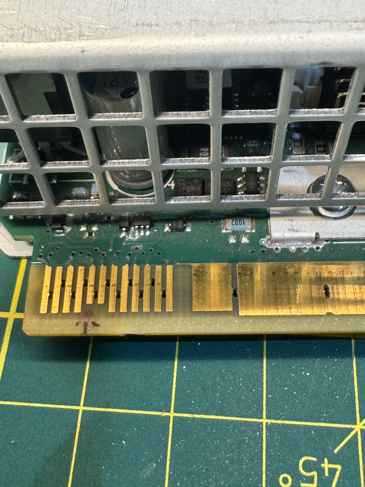
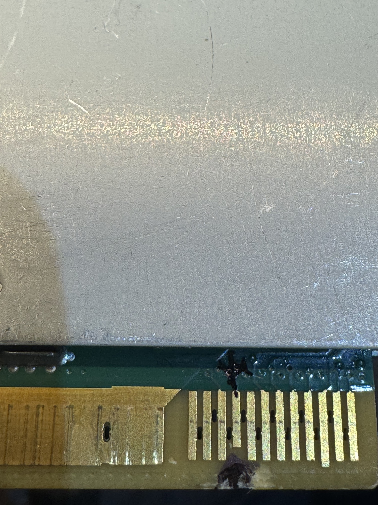

# IBM / Emerson / Artesyn Server PSUs — Standalone Power-On Guide

How to power on two IBM server power supplies **outside of their server**,
for bench use or to power amateur radio / lab equipment. Both units use the
**same enable method** (pins 5 + 21 to GND) and a similar IBM/Lenovo System x
signal connector — they are **not** HP Common Slot despite the resemblance.

This covers two physically different supplies:

- **1400 W / 900 W** — Artesyn **01AF592** (`700-013875`)
- **550 W** — Emerson **7001676-J000** (`94Y8111` / `94Y8112` / `94Y8064`)

> **Disclaimer:** working with mains-powered supplies is dangerous. Bulk
> capacitors hold charge after unplugging — wait and verify before handling.
> This is shared as-is, no warranty. Use a series resistor and a current-
> limited source when probing.

---

# Unit 1 — Artesyn / Astec 01AF592 (1400 W)

## Label data (verbatim)

| Field | Value |
|-------|-------|
| Brand | Artesyn Embedded Technologies |
| Manufacturer | Astec International Limited / Astec Power Philippines |
| Model | **700-013875-0000** REV BB |
| FRU P/N | **700-013875-0200** |
| IBM P/N | **01AF592** |
| IBM FRU P/N | **01AF592** |
| EC No. | P02891 |
| Made in | Philippines |
| Mfg date | 2017-06-28 |
| Efficiency | 80 Plus Platinum |
| Serial | 11S01AF592YL10KY76WZWC |

## Input / Output (dual rating by line voltage)

This unit is **derated on low line** — it delivers full power only at 200–240 V.

| Input | Output | Total power |
|-------|--------|-------------|
| 100–127 V, 10 A | +12.2 V @ **74 A** | **≤ 900 W** |
| 200–250 V, 8.0 / 6.5 A | +12.2 V @ **115 A** | **≤ 1400 W** |

Standby / aux: **+12.0 V aux @ 2.5 A** (always present with AC applied).

## Cross-references (same supply, other numbers)

Reported by resellers — verify against your own label:

- Sibling unit **01AF591** (airflow variant), also Artesyn 1400 W
- Associated numbers seen in listings: `7001692-J202`, `02CL762`

## Used in

- **IBM DS8880** enterprise storage system *(primary documented use; multiple
  vendor listings)*
- **IBM / Lenovo System x3650 M5** and **x3650 M4 HD** as the optional
  **1400 W** power supply *(these chassis accept 550 W / 750 W / 900 W / 1400 W)*

---

# Unit 2 — Emerson / Astec 7001676-J000 (550 W)

## Label data (verbatim)

| Field | Value |
|-------|-------|
| Brand | Emerson Network Power |
| Manufacturer | Astec International Limited |
| Model | **7001676-J000** REV AM |
| FRU P/N | **7001676-J002** |
| IBM P/N | **94Y8111** |
| IBM FRU P/N | **94Y8112** |
| EC No. | N32302F |
| Made in | China |
| Mfg date | 2014-06-05 |
| Efficiency | 80 Plus Platinum |
| Serial | 11S94Y8111YK11814650C1 |

## Input / Output

| Input | Output | Total power |
|-------|--------|-------------|
| 100–240 V, 6.5 / 3.3 A, 50/60 Hz | +12.2 V @ **45.1 A** | **≤ 550 W** |

Standby / aux: **+12.0 V aux @ 2.5 A**.

## Cross-references (same supply, other numbers)

The same physical 550 W Emerson 7001676 PSU was shipped by IBM under several
part numbers depending on channel/config. All interchangeable:

- IBM P/N **94Y8111** / FRU **94Y8112** *(this unit, label-confirmed)*
- IBM P/N **94Y8064** / FRU **94Y8065** *(seen in listings)*
- Model variants: `7001676-J000`, `7001676-J002`

## Used in

- **IBM / Lenovo System x3550 M4**
- **IBM / Lenovo System x3650 M4** (and x3650 M4 HD)
- **IBM / Lenovo System x3300 M4**

as the **550 W** 80 Plus Platinum power supply option.

---

# Powering them on (applies to BOTH units)

**Jumper pins 5 and 21 to GND.** The main +12 V rail comes up immediately.
It works even with the pins pre-connected before AC is applied — no timing
sequence or I²C handshake is required.

| Pin | Function (likely) | Connection |
|-----|-------------------|------------|
| 5   | Enable (EN)       | to GND |
| 21  | Present (short / late-mate pin) | to GND |

The pin count is from left to right 1-12 on top, and 13-24 on the back. Pin 21 is the the only shorter one on the back. 

> **Honesty note:** the EN vs PRESENT assignment is *inferred* from the
> mechanical pin staggering (the shorter pin mates last → likely PRESENT).
> Formal assignment is **pending oscilloscope verification**. What is
> confirmed by testing: **both pins pulled to GND = output enabled.**

## Critical detail — resistor value matters

Use a **1 kΩ** series resistor on each pin to GND.

With **2.2 kΩ it would NOT latch** — two pull-downs through 2.2 kΩ did not
pull both pins below the logic threshold simultaneously. This single detail
caused hours of confusion. **1 kΩ works; 2.2 kΩ may not.**

## Other findings

- **No I²C / PMBus handshake required** to enable the main rail.
- **No strict minimum load** needed to stay on (a small bulb is enough).
- The `DC` status LED may blink during probing; it goes steady once the
  unit is correctly enabled.

---

# The connector — NOT HP Common Slot

Although it physically resembles a gold-finger card edge, **this is not the
64-pin HP Common Slot (CSPS) pinout.** Applying HP Common Slot pin numbers
will not work. The layout is IBM/Lenovo System x specific:

- Wide power **blades** for +12 V and GND.
- A cluster of thin **signal fingers** at one end.
- **Staggered finger lengths** (late-mate present/enable design).

Map your own connector with a multimeter (AC off for continuity grouping,
then AC on to find the ~12 V standby pin) before trusting any pinout.

---

# Fan control

- 4-wire PWM fan, command frequency **25 kHz**.
- Tach at idle: **~163 Hz** (≈ 4900 RPM), 2 pulses per revolution
  → **RPM = Hz × 30**.
- **Wire colors were swapped vs. the Intel standard on these units:
  blue = TACH, green = PWM.** Always verify by measuring.
- The fan controller runs a **closed RPM loop** (it compensates if you slow
  the fan by hand), so a replacement fan may need a tach signal it accepts.

---

# Credits and related projects

Method based on community writeups of sibling server PSUs:

- [slundell/dps_charger](https://github.com/slundell/dps_charger) — PMBus protocol reference
- [raplin/DPS-1200FB](https://github.com/raplin/DPS-1200FB) — teardown
- [jayzosayers/Common-Slot-Server-Power-Supply-Breakout-Module](https://github.com/jayzosayers/Common-Slot-Server-Power-Supply-Breakout-Module)

# License

MIT — use it, copy it, improve it. If you map the EN/PRESENT pins with a
scope, or confirm more host systems, please open a PR.
